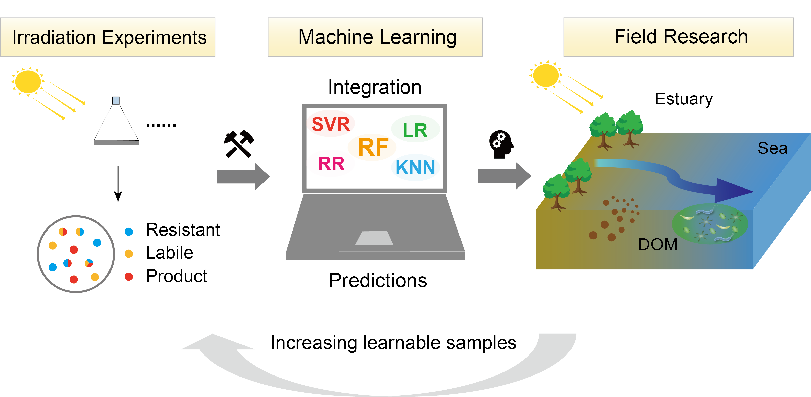

Bio-organic geochemistry in estuaries and coasts
------
 
- **Carbon cycling in coastal bays**  
By using optical techniques and ultra-high-resolution mass spectrometry, we investigated the chemistry of dissolved organic matter (DOM) in Chinese coastal bays. We revealed that decreased nutrients likely activate microbial carbon pump in coastal bays. (Zhao et al., 2021, 2023a, 2023b)

 

- **Photochemical degradation of DOM**  
Dissolved organic matter (DOM) sustains a substantial part of the organic matter transported seaward in large estuaries, where photochemical reactions significantly influence its transformation and fate. Irradiation experiments can provide valuable information on the photochemical reactivity (photo-labile, photo-resistant, and photo-product) of molecules. We revealed that initial compositions of dissolved organic matter determine photochemical transformation. (Zhao et al., 2023c, WR)

 

Big-data and machine learning assisted biogeochemistry
------
**Predicting environmental behaviors of organic molecules**

- **Linking lab-incubation and field work**  
The inconsistency of the fate of irradiated molecules among different experiments curtailed our understanding of the roles the photochemical reactions have played, which cannot be properly addressed by traditional approachesWe offer an expandable and renewable approach based on ML to compatibly integrate existing irradiation experiments and shed insight into DOM transformation and degradation processes. (Zhao et al., 2023, EST)
 

- **Molecular dynamics during degradation**  
As a comprehensive man‐made infrastructure, reservoirs significantly influence the chemical composition, reactivity, and turnover time of dissolved organic matter (DOM) within inland waters. However, it remains elusive how DOM molecules respond to microbial processing over different time scales. We find that shorter incubation periods result in a broader range of molecules disappearing, with a greater contribution of stochasticity, while the longer incubation allows the successive biodegradation of oxygen‐poor compounds, with a greater contribution of directed degradation. As a complement to traditional geochemical methods, we unveiled a novel perspective in understanding the DOM dynamics over time using machine learning. (Zhao et al., 2024a, GRL)

 
